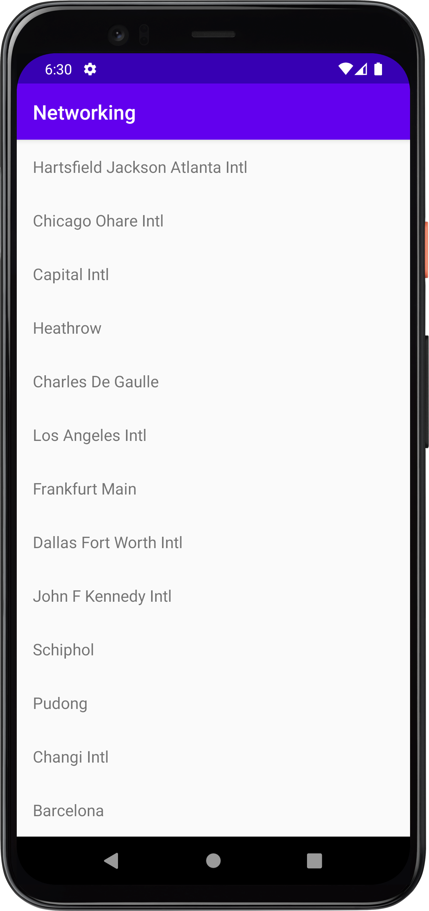

# Rapport
Ändrning: 
Kunde inte uppnå att använda URL för att få information om alla berg kan vara påground av att jag använder min egna mac dator. Slutade med att jag fick använda filen mountains.json i assets mappen för att få alla information att kunna vissas upp. 
La till recyclerView i activity_main.xml layouten för att kunna visa listan över begsnamn. 
```
<androidx.constraintlayout.widget.ConstraintLayout xmlns:android="http://schemas.android.com/apk/res/android"
...
<androidx.recyclerview.widget.RecyclerView
android:id="@+id/recyclerView"
..
 />
``` 

I minActivity.java las det till Arraylist med som var alla berg.och även konfugerade adapter och logken för att hämta och bearbeta JSON-data
```
protected void onCreate(Bundle savedInstanceState) {
// Lista för att lagra bergsnamn
private ArrayList<Mountain> mountainsList = new ArrayList<>(); 

recyclerView = findViewById(R.id.recyclerView);

// Konfigurera layout
recyclerView.setLayoutManager(new LinearLayoutManager(this, LinearLayoutManager.VERTICAL, false)); 

adapter = new MountainAdapter(mountainsList); // Skapa adapter
recyclerView.setAdapter(adapter);

new JsonTask(this).execute(JSON_URL); // Starta nedladdning av JSON-data
}
```

la till detta i JsonTask.java för att bearbeta JSON.data och lägga till alla bergsnamn i listan som är skapad.
```
@Override
public void onPostExecute(String json) {
    try {
        JSONArray jsonArray = new JSONArray(json);
        for (int i = 0; i < jsonArray.length(); i++) {
            JSONObject jsonObject = jsonArray.getJSONObject(i);
            String name = jsonObject.getString("name");
            
            // Lägg till bergsnamn i lista
            mountainsList.add(new Mountain(name)); 
        }
        // Uppdatera RecyclerView
        adapter.notifyDataSetChanged(); 
    } catch (JSONException e) {
        e.printstacktrace();
    }
}
```

skapade även en recyclerview_item.xml för att kunna definiera layouten för objekten i RecyclerView. med hjälp av TextView
```
<androidx.constraintlayout.widget.ConstraintLayout
    ....
    <TextView
        android:id="@+id/title"
        android:layout_width="match_parent"
        android:layout_height="wrap_content"
        ....
        />
```

I mountain klassen som skapdes så gjordes en geter för alla bergs namn och även en toString.
```
@Override                                       
    public String toString() {                  
        return "Mountain (name='" + name + "')";
}                            
```



